# AATES Database Schema Manual

This guide describes the initial database schema structure and entity relationships of the AATES platform.

## Entity Relationship Diagram

```mermaid
erDiagram
    Users {
        UUID id PK
        String email
        String hashed_password
        Boolean is_active
        Boolean is_superuser
        DateTime created_at
    }
    Roles {
        UUID id PK
        String name
        String description
    }
    Permissions {
        UUID id PK
        String name
        String description
    }
    AuditLogs {
        UUID id PK
        UUID user_id FK
        String action
        String ip_address
        DateTime timestamp
    }
    Jobs {
        UUID id PK
        String name
        String status
        DateTime scheduled_at
        Integer run_count
        Integer retry_limit
    }
    SystemStates {
        UUID id PK
        String state_key
        JSONB state_value
        DateTime updated_at
    }
    FeatureFlags {
        UUID id PK
        String flag_name
        Boolean is_enabled
        String description
    }
    WorkflowDefinitions {
        UUID id PK
        String name
        String version
        JSONB steps
        DateTime created_at
    }
    WorkflowExecutions {
        UUID id PK
        UUID workflow_id FK
        String status
        String current_step
        JSONB inputs
        JSONB outputs
        DateTime started_at
    }
    AIProviders {
        UUID id PK
        String provider_name
        Boolean is_active
        String api_endpoint
    }
    ModelConfigurations {
        UUID id PK
        UUID provider_id FK
        String model_name
        JSONB parameters
    }
    Budgets {
        UUID id PK
        UUID universe_id
        Float allocated_amount
        Float spent_amount
        String currency
    }
    Assets {
        UUID id PK
        String type
        String provider
        String model
        String prompt_version
        String prompt_hash
        Integer seed
        String resolution
        Float duration
        String storage_location
        UUID episode_id
        UUID universe_id
        Float cost
        DateTime created_at
    }
    ProductionQueue {
        UUID id PK
        UUID universe_id
        Integer season
        Integer episode
        Integer priority
        String status
        UUID workflow_id
        String assigned_worker
        DateTime scheduled_time
    }
    ProductionTasks {
        UUID id PK
        UUID queue_id FK
        String task_name
        String status
        Text logs
    }
    DecisionLogs {
        UUID id PK
        String actor_name
        String decision_type
        JSONB payload
        DateTime timestamp
    }

    Users ||--o{ AuditLogs : "creates"
    WorkflowDefinitions ||--o{ WorkflowExecutions : "defines"
    AIProviders ||--o{ ModelConfigurations : "registers"
    ProductionQueue ||--o{ ProductionTasks : "executes"
```

## Schema Configuration Notes
1. **Engine Compatibility**: SQLite dynamically compiles the `JSONB` columns to standard SQLite `JSON` strings when running unit tests locally.
2. **UUID Mapping**: All tables use globally unique 128-bit identifiers (`UUID`) as primary keys instead of auto-increment integers.
